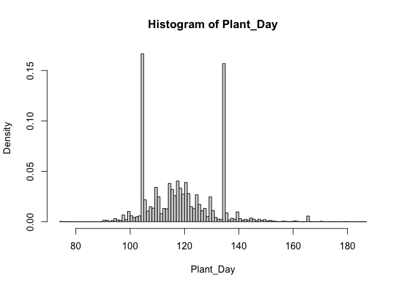
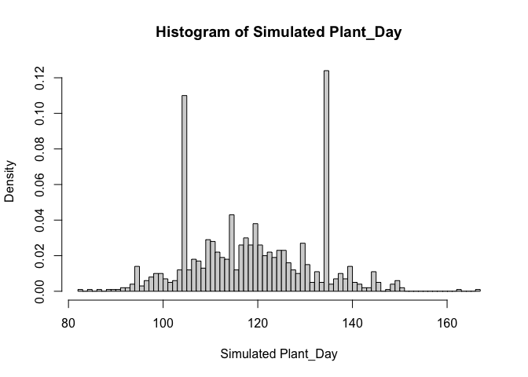
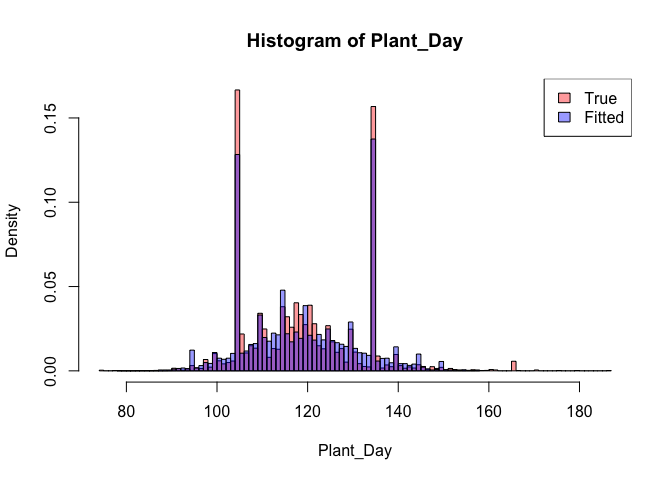

Mixture Distribution of Response Heaping in CEAP Plant\_Day
================

## 0.1 Heaping in CEAP Plant\_Day

In the analysis of the CEAP data, we noticed one characteristic about
the Plant\_Day, which also appears in other surveys, that responses heap
on day 5, 10, 15, 20, 25, 30 of April and May, particularly on the
15th.  
Figure <a href="#fig:hist-doy">1</a> shows the histogram of Plant\_Day
of corn in ceap\_region 7.

<div class="figure">



<p class="caption">

Figure 1: Histogram of Plant\_Day

</p>

</div>

## 0.2 Mixture Distributions

It is natural to assume that the distribution of Plant\_Day is a mixture
of a multinomial distribution which takes values on multiple of five and
a flexible distribution of wide range such as Gamma.

### 0.2.1 Monte Carlo Simulation

First, we generate a mixture of Multinomial and Gamma. We assume the
true underlying distribution is *Gamma(a, b)*, with
\(a = 118 * 0.75 = 88.5\), and \(b = 0.75\), which give a mean of
\(a/b=118\) and variance of \(a/b^2=157.33\). There is a \(p=1/3\)
probability that response heaps on the multiple of 5. We assume that the
heaping responses follow a multinomial distribution as follows:

| \(H\)   | 95   | 100  | 105 | 110  | 115  | 120  | 125  | 130  | 135 | 140  | 145  | 150  |
| ------- | ---- | ---- | --- | ---- | ---- | ---- | ---- | ---- | --- | ---- | ---- | ---- |
| \(p_h\) | 1/40 | 1/40 | 1/3 | 1/24 | 1/24 | 1/24 | 1/24 | 1/24 | 1/3 | 1/40 | 1/40 | 1/40 |

We generate \(N=1000\) points, with \(m \sim Binomial(N, p)\) heaping
points from the multinomial distribution and \(N-m\) points from the
Gamma distribution. Histogram of the simulated Plant\_Day is shown in
figure <a href="#fig:hist-sim">2</a>.

``` r
# total N points
N <- 1000
# m heaping points: Bernoulli with p
p <- 1/3
m <- rbinom(1, N, p)
# heaping from multinomial distribution with prob p_h
p_h <- c(rep(3/120, 2), 40/120, rep(5/120, 5), 40/120, rep(3/120, 3))
h <- rmultinom(1, size = m, prob = p_h)
heap <- 90 + 1:12*5
x_heap <- rep(heap, h)
# N-m true points: Gamma with a and b, mean=a/b, var=a/(b^2)
a <- 118*0.75
b <- 0.75
x_true <- round(rgamma(N-m, a, b))
# mix to get x
X <- c(x_heap, x_true)
```

<div class="figure">



<p class="caption">

Figure 2: Histogram of Simulated Plant\_Day

</p>

</div>

Next, we use EM-algorithm to solve for the MLE of parameters in the
mixed model, i.e. \(p\), \(p_h\), \(a\) and \(b\).

``` r
# count of points on heaping days
count_heap <- as.vector(table(X)[as.character(heap)])
n <- sum(count_heap)

# lambda in Lagrange multiplier -- helper function to analytically solve for p_h
lambda <- function(heap, a, b, pi){
  n / (sum(dgamma(heap, shape = a, rate = b)) * (1-pi)/pi + 1)
}

# negative log-likelihood of mixed distribution
nll <- function(par, X, pi, p_h){
  
  a <- par[1]
  b <- par[2]
  p_mul <- colSums(sapply(X, FUN=function(x){(x == heap)*1}) * p_h)
  L[,1] <<- p_mul*pi
  L[,2] <<- dgamma(X, shape = a, rate = b)*(1-pi)
  return(-sum(log(rowSums(L))))
}

# EM main function
mixture.EM <- function(pi.init, p_h.init, a.init, b.init, X) {
  
  # initialize parameters
  pi.curr <- pi.init
  p_h.curr <- p_h.init
  a.curr <- a.init
  b.curr <- b.init
  
  # store log-likelihoods for each iteration
  log_liks <- c()
  ll       <- -nll(c(a.curr, b.curr), X, pi.curr, p_h.curr)
  log_liks <- c(log_liks, ll)
  delta.ll <- 1
  
  while(delta.ll > 1e-5) {
    
    # E-step to update p
    z_ik <- L
    z_ik[,1] <- pi.curr*z_ik[,1]
    z_ik[,2] <- (1-pi.curr)*z_ik[,2]
    z_ik <- z_ik / rowSums(z_ik)
    L <<- z_ik
    pi.curr   <- (colSums(z_ik)/sum(z_ik))[1]
    
    # call helper function to solve for p_h
    lbd <- lambda(heap, a.curr, b.curr, pi.curr)
    p_h.curr <- count_heap/lbd - dgamma(heap, shape = a.curr, rate = b.curr)*(1-pi.curr)/pi.curr
    p_h.curr[p_h.curr<0] <- 0 # could have negative components; set to 0
    
    # M-step to update other parameters: a and b of Gamma distribution
    op <- nlm(f=nll, p=c(a.curr, b.curr), X=X, pi=pi.curr, p_h=p_h.curr)
    par.curr <- op$estimate
    a.curr <- par.curr[1]
    b.curr <- par.curr[2]
    
    # update likelihood
    ll <- -nll(c(a.curr, b.curr), X, pi.curr, p_h.curr)
    log_liks <- c(log_liks, ll)
    
    # improvement in likelihood
    delta.ll <- log_liks[length(log_liks)]  - log_liks[length(log_liks)-1]
    
  }
  return(list("par" = c(pi.curr, p_h.curr, par.curr), "ll" = log_liks))
}
```

``` r
# store likelihood in L
L <- matrix(NA, nrow=length(X), ncol= 2)
# call EM main function to solve for MLE
em <- mixture.EM(0.5, rep(1/12, 12), 100, 1, X)
# compare parameter estimates to truth
est <- data.frame("MLE" = round(em$par,3), "Truth" = round(c(p, p_h, a, b),3))
est
```

    ##       MLE  Truth
    ## 1   0.261  0.333
    ## 2   0.034  0.025
    ## 3   0.003  0.025
    ## 4   0.327  0.333
    ## 5   0.023  0.042
    ## 6   0.059  0.042
    ## 7   0.042  0.042
    ## 8   0.004  0.042
    ## 9   0.039  0.042
    ## 10  0.395  0.333
    ## 11  0.029  0.025
    ## 12  0.028  0.025
    ## 13  0.016  0.025
    ## 14 91.843 88.500
    ## 15  0.775  0.750

``` r
# print log-likelihood
em$ll
```

    ## [1] -4753.784 -3681.670 -3673.113 -3676.726

### 0.2.2 Application to the CEAP

In order to get the true underlying distribution of Plant\_Day in CEAP,
we apply the above multinomial and Gamma mixed distribution EM algorithm
to the Plant\_Day data to estimate the parameters.

``` r
# estimate for distribution of Plant_Day
L <- matrix(NA, nrow=length(ceap$plant_doy), ncol= 2)
em <- mixture.EM(0.5, rep(1/12, 12), 100, 1, ceap$plant_doy)
# print parameter estimates
round(em$par, 3)
```

    ##  [1]   0.356   0.035   0.013   0.301   0.040   0.071   0.055   0.018   0.044
    ## [10]   0.351   0.029   0.027   0.015 100.001   0.840

``` r
# print log-likelihood
em$ll
```

    ## [1] -35743.28 -26802.61 -26770.97 -26766.12 -26771.77

Next, we simulate the mixed distribution by our estimated parameters.
Then, we add the histogram of the simulated mixed distribution to
<a href="#fig:hist-doy">1</a> for comparison with the real data. Figure
<a href="#fig:hist-fit">3</a> shows both histograms.

``` r
# store parameter estimates
p_est <- em$par[1]
p_h_est <- em$par[2:13]
a_est <- em$par[14]
b_est <- em$par[15]

# simulate by estimated parameters
N <- length(ceap$plant_doy)
m <- rbinom(1, N, p_est)
h <- rmultinom(1, size = m, prob = p_h_est)
x_heap <- rep(heap, h)
x_true <- round(rgamma(N-m, a_est, b_est))
X <- c(x_heap, x_true)
```

<div class="figure">



<p class="caption">

Figure 3: Histogram of Simulated and Real Plant\_Day

</p>

</div>
